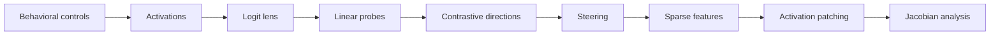

# Latent TRIZ

**Does invention have a geometry?**
**Do language models rediscover general operators of invention?**

Latent-TRIZ investigates whether TRIZ-style inventive transformations emerge as reusable geometric structures inside language models.

Latent TRIZ is an open laboratory for testing whether language models learn internal, cross-domain, and causally active transformations that resemble TRIZ Inventive Principles. The project combines reproducible experiments, mechanistic interpretability, blinded evaluation, and explicit falsification criteria.

> **Current evidence boundary:** the repository contains immutable positive
> A0/R1 automated-proxy packages and published `null` packages from the
> reference-integrated and seven-model comparative studies. These results are
> exploratory automated proxies, not expert-validated TRIZ constructs, causal
> evidence, or evidence for the Strong Latent TRIZ Hypothesis. Every registered
> claim remains at E0.

The current public checkpoint, model-by-model results, integrity boundaries, and
next evidence gate are summarized in [Current Laboratory Status](docs/CURRENT_STATUS.md).

## Run the laboratory

```bash
git clone https://github.com/MarcoPorcellato/Latent-TRIZ.git
cd Latent-TRIZ
make lab
```

This opens the local Lab Suite dashboard for the maintained Lab 00–05 artifacts. It requires only Python 3.11 or newer, downloads nothing, and makes every readiness and evidence boundary visible. The cross-platform canonical command, which does not require Make, is:

```bash
PYTHONPATH=src python3 -m latent_triz.cli lab-suite --root . --output artifacts/lab/index.html --open
```

The dashboard does not rerun models or experiments. It verifies and links the tracked reports so a fresh user can inspect the current laboratory immediately. Red readiness cards are documented scientific gaps, not dashboard failures.

Developer validation and target-specific readiness reports are separate:

```bash
make check
make readiness TARGET=foundation
make lab01-bootstrap
make readiness TARGET=lab01
make readiness TARGET=lab02
make readiness TARGET=lab03
make readiness TARGET=lab04
make readiness TARGET=lab05
make readiness TARGET=exp001
```

Readiness is fail-closed and target-specific. `foundation` validates repository integrity, `lab01` verifies the local exact-revision model and instrumentation bundle, `lab02` renders dataset-release readiness, `lab03` renders surface-baseline readiness, `lab04` renders representation decodability readiness, `lab05` renders descriptive candidate-direction readiness without publishing dense vectors, and `exp001` evaluates the model-candidate and dataset gates. A selected model is only **model-contract-ready** or **model-preflight-ready** until acquisition, integrity, load, and instrumentation receipts prove otherwise.

## Local visual laboratory

The Lab Suite is the one-command public visual surface for Lab 00 through Lab 05. It shows status, empirical classification, claim eligibility, source fingerprints, and links to every detailed report without recomputing scientifically incomparable results.

Run the headless variant with no model, API key, service, or package installation:

```bash
make lab-render
```

`make lab` renders Lab 00 from its deterministic smoke chain, verifies all maintained classifications, writes `artifacts/lab/index.html`, and opens it. For headless environments, `make lab-render` writes the same byte-stable dashboard without opening a browser. The underlying command is:

```bash
PYTHONPATH=src python3 -m latent_triz.cli lab-suite --root . --output artifacts/lab/index.html --open
```

Use `make lab00` for the standalone synthetic Stage 1 smoke view. See the [Lab Suite runbook](docs/LAB_SUITE.md) for the aggregation and no-claim contract.

For a guided, interactive orientation across selected public studies, models,
decisions, and source documents, see the optional [Research Observatory](scripts/research_observatory/README.md).
It is a read-only navigation aid; the Lab Suite, source records, and verifiers
remain authoritative. It excludes unpublished local recovery material.

## The hypothesis

The **Weak Latent TRIZ Hypothesis** predicts that pretrained language models contain representations corresponding to at least some TRIZ Inventive Principles and that those representations generalize across substantially different domains.

The **Strong Latent TRIZ Hypothesis** predicts that a neural sequence model can develop functionally equivalent representations from unlabelled problem-solution examples without receiving TRIZ terminology, definitions, principle labels, or canonical examples.

- **Track A — pretrained models:** inspect openly available base and instruction-tuned checkpoints for cross-domain, causally active TRIZ-like representations.
- **Track B — controlled emergence:** train small Transformers on fully inspectable corpora that exclude explicit TRIZ material.

A probe score, attractive cluster, or behavioral anecdote is insufficient. Strong evidence must converge across lexical controls, cross-domain transfer, causal intervention, bidirectionality, novel cases, composition, model families, and controlled emergence.

## Evidence Ladder

| Level | Meaning | Minimum interpretation |
|---|---|---|
| E0 | Hypothesis | Registered, falsifiable, no empirical support claimed |
| E1 | Behavioral observation | Effect observed under documented behavioral controls |
| E2 | Cross-domain decodability | Representation decodes beyond lexical and domain shortcuts |
| E3 | Causal steering | Intervention changes behavior in the predicted direction |
| E4 | Bidirectional causality | Opposing interventions produce opposing, controlled effects |
| E5 | Cross-model replication | Result reproduces across independent model families or teams |
| E6 | Controlled emergence | Equivalent operators emerge in a controlled training setting |

Promotion is evidence-bound: a claim may advance only when its preregistration, immutable dataset snapshot, run records, results, and replication links satisfy the level's proof obligations. See the [Evidence Ladder](docs/EVIDENCE_LADDER.md) and machine-readable [claim registry](data/claims.jsonl). The initial claims are all E0 and untested.

## Results so far

The public record now contains both positive exploratory proxy observations and
carefully published null controls. They are not pooled, and none is expert-
validated TRIZ evidence.

| Study | Result | What it means |
| --- | --- | --- |
| A0 automated proxy | positive, `p=0.005`, 24/24 paired-family successes | A frozen procedural proxy produced a cross-domain signal; it is E0 exploratory evidence, not a TRIZ construct validation. |
| A0-R1 independent replication | positive, `p=0.002`, 23/24 family successes | The same proxy persisted on an independent procedural corpus; it remains exploratory and claim-free. |
| EXP-001 reference-integrated SmolLM2 | `null` | The source-blinded/source-exposed reference-task design did not meet its frozen primary endpoint. |
| EXP-001 comparative models | seven independent terminal `null` packages | Pythia, SmolLM2-360M, Qwen3, GPT-2, SmolLM2-135M, GPT-Neo, and Qwen2.5 produced no robust pooled signal. Qwen3 was a descriptive near-threshold case (`p=0.0625`) but correctly remained `null`. |

The [current status page](docs/CURRENT_STATUS.md) contains the per-model p-values,
effect estimates, resource receipts, package links, and fresh-clone integrity
results. The [hypothesis contract](docs/HYPOTHESES_AND_FALSIFICATION.md) explains
why these observations neither prove nor falsify the construct-level hypothesis.

## From visible behavior to mechanism

The planned experimental route deliberately grows in complexity:



Each step must earn the next. The near-term target is a local, visual, one-command exploration lab; the current Stage 1 smoke establishes the artifact and evaluation path that this empirical work will use.

## Public artifact chain

```text
hypothesis -> preregistration -> dataset snapshot -> study manifest
           -> immutable run records -> blinded evaluation -> versioned results
```

Exploratory work may happen earlier, but it remains visibly separate from confirmatory records. Results are versioned rather than overwritten, and model, prompt, seed, environment, schema, and output hashes travel with every run.

## Start here

- [Current laboratory status](docs/CURRENT_STATUS.md) — public checkpoint, seven-model result table, and next gate
- [Documentation portal](docs/index.md) — maintained documentation map
- [Evidence Ladder](docs/EVIDENCE_LADDER.md) — claim promotion rules E0–E6
- [Local visual laboratory suite](docs/LAB_SUITE.md) — one-command Lab 00–05 dashboard and scientific boundary
- [Stage 1 blinded pilot](docs/STAGE1_PILOT.md) — runnable packet, response, annotation, and summary contracts
- [Lab 00 boundary](docs/STAGE1_PILOT.md#evidence-boundary) — presentation-only synthetic smoke view
- [Lab 01 model anatomy](docs/LAB01.md) — real-model instrumentation, G1-G8, and no-claim boundary
- [Lab 01 representation extraction](docs/LAB01_REPRESENTATIONS.md) — offline residual-stream batches, external Safetensors, and the verified Lab 04 bridge
- [Lab 02 dataset anatomy](docs/LAB02.md) — snapshot integrity, leakage, balance, annotation reliability, and no-claim boundary
- [Lab 03 behavioral baselines](docs/LAB03.md) — lexical and shallow controls before any representation claim
- [Lab 04 decodability](docs/LAB04.md) — deterministic probe and control contract before any representational claim
- [Lab 05 candidate directions](docs/LAB05.md) — descriptive controls with no dense-vector publication, intervention, or causal claim
- [Research protocol](docs/RESEARCH_PROTOCOL.md) — controls, metrics, and decision criteria
- [Laboratory master plan](docs/LABORATORY_MASTER_PLAN.md) — canonical evolution map from delivered milestones to EXP-001-R
- [A0 automated exploration](docs/A0_AUTOMATED_WEAK_HYPOTHESIS.md) — fully automated, pre-expert proxy test of the weak hypothesis
- [Roadmap](docs/ROADMAP.md) — living milestone map for the visual labs, EXP-001, and the replication program
- [EXP-001 readiness gates](docs/EXP001_READINESS.md) — offline model/dataset checks and remaining blockers
- [Article](docs/ARTICLE.md) and [article status](docs/ARTICLE_STATUS.md) — hypothesis framing and provenance
- [Claim registry](data/claims.jsonl) and [claim schema](schemas/claim.schema.json) — falsifiable public claims
- [Discussions](https://github.com/MarcoPorcellato/Latent-TRIZ/discussions) — research questions and collaboration

## Four contribution lanes

- **Lane 0 — Learning:** reproduce a tutorial or smoke path; no scientific claim is promoted.
- **Lane 1 — Exploratory:** add a clearly labeled probe, visualization, dataset audit, or candidate mechanism.
- **Lane 2 — Confirmatory:** execute a frozen preregistration against a sealed dataset and immutable run contract.
- **Lane 3 — Independent replication:** reproduce a result with an independent model family, dataset, implementation, or team.

TRIZ practitioners can help operationalize principles and design negative cases. Interpretability researchers can build probes and interventions. Python contributors can improve the lab and visual tooling. Statisticians can review power, multiplicity, and decision rules. Contributors with limited hardware can work on schemas, fixtures, annotation, documentation, or small-model experiments.

Read [CONTRIBUTING.md](CONTRIBUTING.md) before proposing a claim-level change.

## Repository status

- Foundation governance and schemas: implemented
- Schema integrity: fail-closed local Draft 2020-12 subset plus pinned `jsonschema` cross-validation and mutation tests
- Matryca-Knowledge-style maintained documentation bundle: implemented
- CI cost boundary: docs-only pull requests use lightweight documentation checks; code and scientific changes follow the stable merge-policy/gate with Python 3.11 and 3.12 compatibility checks plus exact-head CCP where required
- Stage 1 deterministic blinded-pilot smoke: implemented, synthetic, non-empirical
- Annotation ontology v1.1: current on `main`; the v1.2 packet is ready for collection, with a real three-expert cognitive-pilot gate still pending
- Lab 00 public visual surface: implemented, infrastructure-only, not claim-attached
- Lab 01 model anatomy: implemented on an exact-revision didactic model; empirical instrumentation only, not claim-eligible
- Model-backed representation bridge: implemented for exact-revision Pythia smoke runs; real activations remain exploratory and not claim-eligible
- Lab 02 dataset anatomy: implemented as a synthetic, hash-backed dataset-readiness report; not claim-eligible
- Lab 03 behavioral baselines: implemented with field-specific and provenance shortcut diagnostics; the current Wave 1 batch is rejected for freeze and is not claim-eligible
- Lab 04 decodability: implemented as a deterministic, synthetic pass/fail probe boundary with explicit non-claim interpretation; not claim-eligible
- Lab 05 candidate directions: implemented as deterministic descriptive instrumentation; current fixture is not ready and no dense vectors or claims are published
- A0 automated proxy exploration: published positive exploratory result with
  frozen controls and immutable receipts; not expert-validated and not
  claim-eligible
- EXP-001 reference-integrated study: published `null` SmolLM2 package with
  separate `TRIZ-blinded-transfer` and `source-exposed-competence` strata
- EXP-001 comparative study: seven independent, non-pooled, terminal `null`
  model packages with exact model/runtime receipts, one-shot CCP gates, and
  fresh-clone asset-integrity verification
- Empirical support for registered Latent TRIZ claims: none claimed; all remain E0

## License and attribution

Copyright 2026 Marco Porcellato ([`MarcoPorcellato`](https://github.com/MarcoPorcellato)).

Licensed under the [Apache License 2.0](LICENSE). Attribution information is recorded in [NOTICE](NOTICE).
